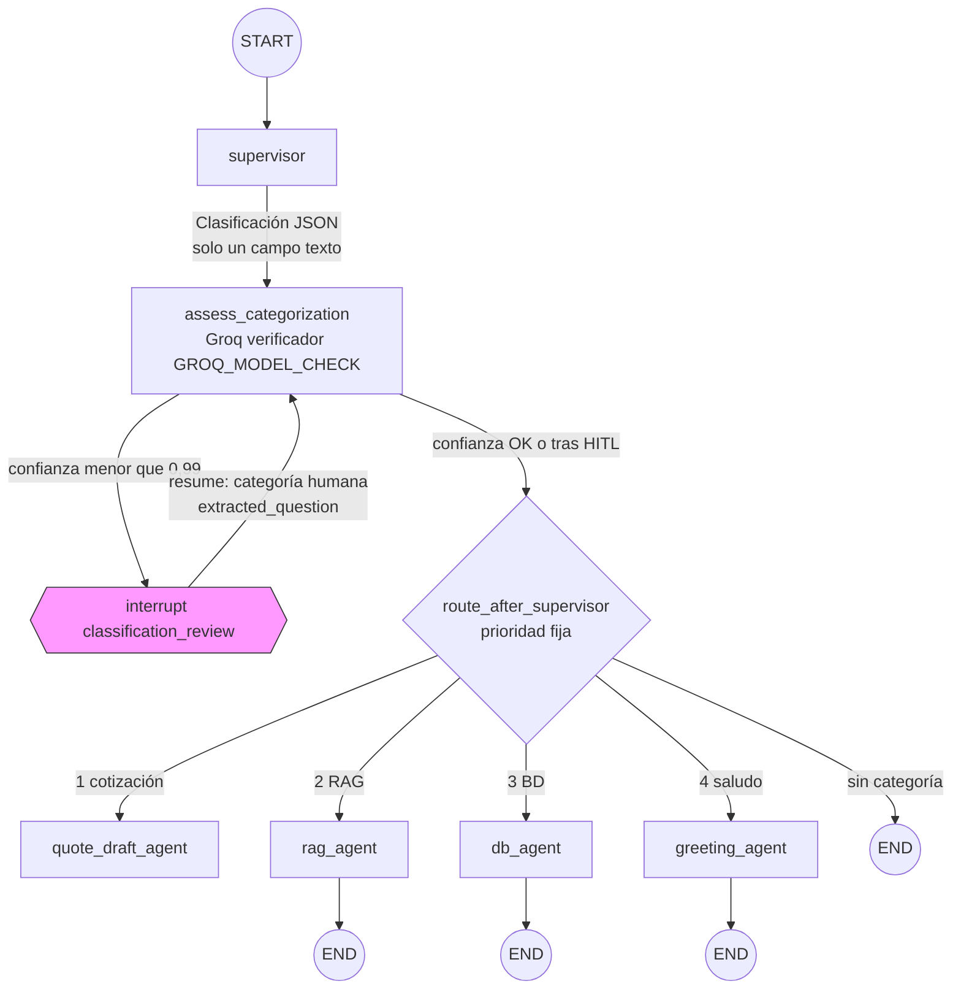
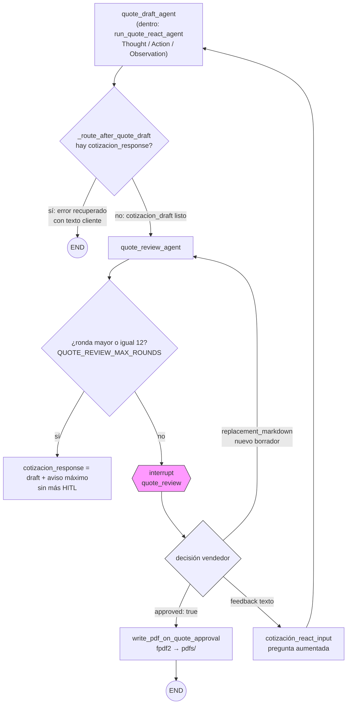
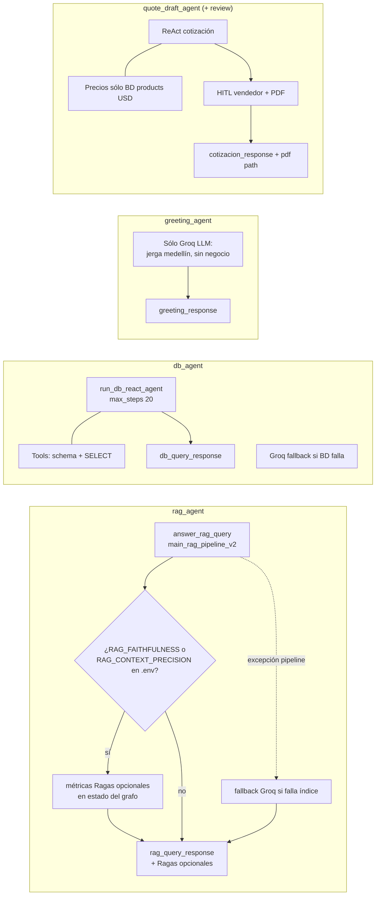

# Supervisor LangGraph — flujo detallado (`agents/playground/supervisor.py`)

Vista ejecutiva para exposición: enrutamiento, **human-in-the-loop (HITL)** y responsabilidades de cada nodo.

> **Umbral clasificación:** el verificador usa `confidence >= 0.99` para aceptar automáticamente; si falla → `interrupt` y corrección por categoría + texto (`interactive_chat.py`).

## 1. Grafo principal (nodos y prioridad de enrutamiento)

**Aclaración:** `supervisor` y el **verificador** usan Groq (`GROQ_API_KEY`). Tras `interrupt`, LangGraph **reanuda** el mismo nodo `assess_categorization`, que fusiona la decisión humana y ejecuta la función `route_after_supervisor`.

**Prioridad codificada** (solo un camino simultáneo): cotización → RAG → base de datos → saludo → fin.

## 2. Ciclo cotización — borrador → revisión → PDF opcional

## 3. Qué hace cada worker (referencia rápida)

### Tabla texto (speaker notes)

| Nodo | Entrada efectiva | Comportamiento clave |
|------|-------------------|---------------------|
| **supervisor** | último mensaje usuario | Una categoría: `cotización` > `BD` > `RAG` > `saludo` |
| **assess_categorization** | misma clase + texto completo copiado al campo ganador | Segundo modelo valida confianza; si baja → HITL |
| **rag_agent** | `rag_query_question` | Chroma + retrieval; Ragas sólo si flags env |
| **db_agent** | `db_query_question` | ReAct SQL lectura sólo sobre Postgres |
| **quote_draft_agent** | pregunta o `cotizacion_react_input` (feedback) | ReAct hasta Markdown de cotización |
| **quote_review_agent** | borrador Markdown | Interrupt; aprobación → PDF opcional |
