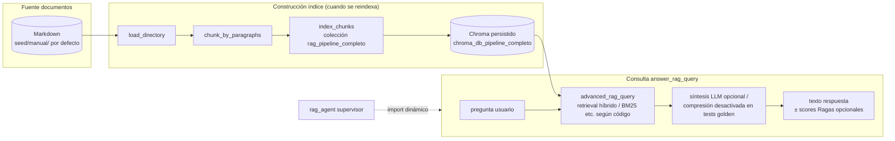

# RAG stack — vista para contexto del supervisor (`rag.main_rag_pipeline_v2`)

Diagrama corto útil antes de entrar en el grafo LangGraph.

**Mensaje clave:** El supervisor no reimplementa RAG — delega en `answer_rag_query`; el mismo pipeline se **reaprovecha** en golden pytest para medir respuestas coherentes con el conocimiento indexado.
