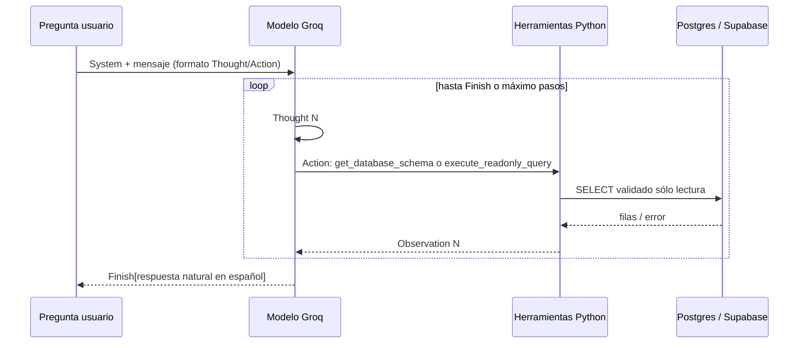
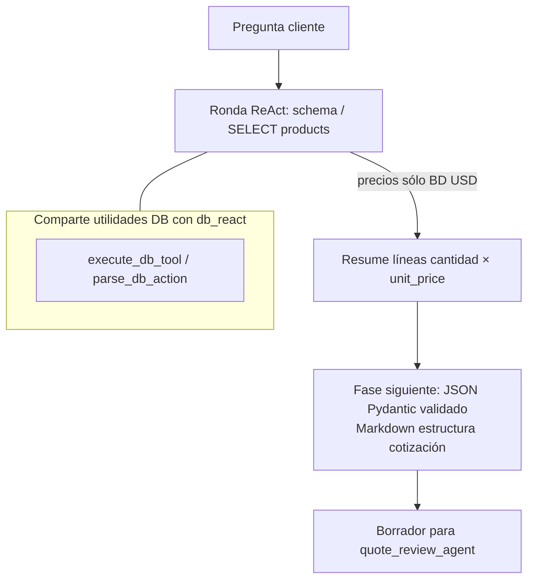

# ReAct interno — BD y cotización (`db_react_agent` / `quote_react_agent`)

Para preguntas de audiencia técnica: cómo convergen herramientas y el LLM dentro de cada agente especializado.

## Agente BD (solo lectura)

## Agente cotización (catálogo + documento Markdown)

**Diferenciación rápida en charla:**

- **BD general:** cualquier tabla permitida por `db_tools` (consultas tienda/inventario/ventas).
- **Cotización:** playbook orientado a `products`; el borrador debe justificar totales antes del HITL del vendedor.
